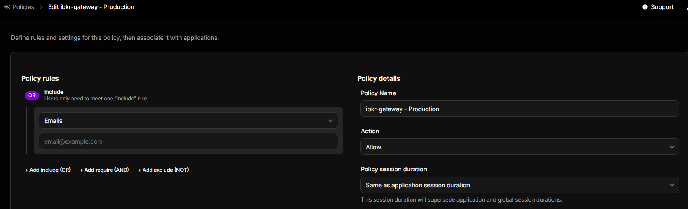
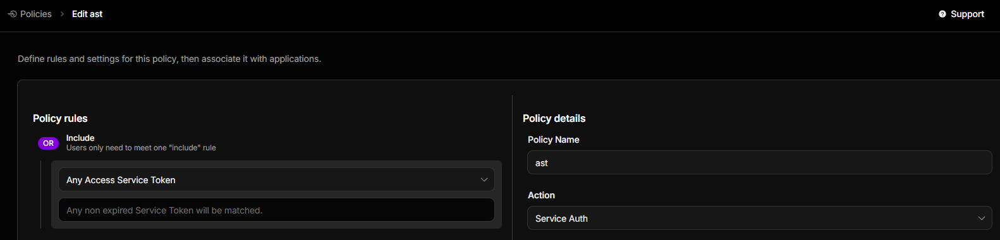
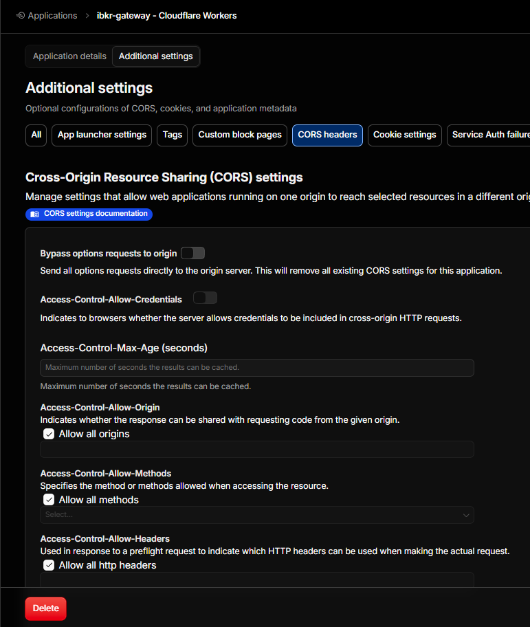

# 🚀 IBKR Web API Gateway For Cloudflare Workers 🌐

[🇨🇳 中文说明](#-中文说明) | [🇬🇧 English Documentation](#-english-documentation)

---

## 🇨🇳 中文说明

超级简单部署和使用的边缘计算版本 IBKR Web API 网关。

本项目利用 Cloudflare Durable Objects 来确保单一实例运行，并通过官方最新的
OpenAPI JSON 实现了优雅的 Scalar 文档。

### 🛠️ 核心功能

#### 📡 API 转发

**纯透明管道转发**：自动处理 HTTP
headers，你只需像阅读官方文档一样，专注于业务参数即可。

在访问/iserver
等端点前，你必须初始化会话进入完全访问模式。`/iserver/auth/ssodh/init`

> ⚠️ **注意**: 如果 KV 缓存未过期或 LST 提前失效，请主动调用 `/oauth` 端点刷新
> LST，以防止出现错误的 `401 Unauthorized` 报错。

#### 🔌 WebSocket 桥接

**纯透明管道桥接**：不做任何中间处理，数据直接透传。 🔗 _测试 Demo_:
请查看源码目录下的 `public/ws.html` 了解如何建立连接。

### 🔐 身份验证

**零负担安全控制！** 本项目不手动编写鉴权逻辑，而是完全依赖 **Cloudflare Zero
Trust Access Controls** 进行访问控制。

- 🖥️ **网页端**: 用户可以通过友好的邮箱验证码登录。

- 🤖 **终端/API端**: 程序和脚本交互可直接使用 Service Credentials
  (服务凭证)Service Tokens。

完美兼顾了人类用户和程序的访问需求，安全又省心！🛡️

### 🚀 如何开始？

#### 1️⃣ 生成证书

你需要先生成一套 `OAuth 1.0` 必备的证书文件。详细步骤请参考这篇出色的指南： 👉
[IBKR OAuth1.0a 证书生成指南](https://github.com/Voyz/ibind/wiki/OAuth-1.0a)

#### 2️⃣ 配置环境变量

在 Cloudflare Workers 网页的设置中，将证书和 Token 添加到变量绑定中。

**⚠️ 重要提醒**: 必须使用 **“Secret (加密密钥/机密)”**
类型，这样才能支持多行字符串格式！ 此外，`encryptionKey` 和 `signatureKey`
都必须是 **Private Key (私钥)**，千万不要填成了公钥。

**需要绑定的变量列表:**

- 🔑 `accessToken`
- 🔑 `accessTokenSecret`
- 🔑 `consumerKey`
- 🔑 `dhParam`
- 🛡️ `encryptionKey` _(必须是 Private Key)_
- 🛡️ `signatureKey` _(必须是 Private Key)_

## 保持活跃

IBKR 的判断非常活跃，你必须大概一分钟就需要进行一次 `PING`
来保持完全访问。否则自动进入只读模式。

### http 端点

`/v1/api/tickle`

### WS 命令

`tic`

---

# CORS

## 

## 🇬🇧 English Documentation

A super simple-to-deploy-and-use edge computing version of the IBKR Web API
Gateway.

This project utilizes Cloudflare Durable Objects to ensure a single instance
runs globally, and implements elegant Scalar documentation using the latest
official OpenAPI JSON.

### 🛠️ Core Features

#### 📡 API Forwarding

**Transparent Pipe Forwarding**: Automatically handles HTTP headers. Just focus
on your business parameters, exactly as the official docs suggest.

Before accessing endpoints such as /iserver, you must initialize the session to
enter full access mode. `/iserver/auth/ssodh/init`

> ⚠️ **Note**: If the KV cache has not expired or the LST becomes invalid early,
> please manually call the `/oauth` endpoint to refresh the LST and prevent
> false `401 Unauthorized` errors.

#### 🔌 WebSocket Bridging

**Transparent Bridge**: No middleware processing, direct data pass-through. 🔗
_Test Demo_: Check out `public/ws.html` in the source code to see how to
establish a connection.

### 🔐 Authentication

**Zero-burden security!** This project does not manually implement
authentication logic. Instead, it relies entirely on **Cloudflare Zero Trust
Access Controls**.

- 🖥️ **Web Users**: Can log in seamlessly using friendly Email OTP.

- 🤖 **Terminal/API**: Programmatic interactions can directly use Service
  Credentials. (Service Tokens)

 Perfectly balancing the access needs of
both humans and machines, keeping it secure and hassle-free! 🛡️

### 🚀 How to Get Started?

#### 1️⃣ Generate Certificates

First, you need to generate a set of necessary certificate files for
`OAuth 1.0`. For detailed steps, please refer to this excellent guide: 👉
[IBKR OAuth1.0a Guide by Voyz](https://github.com/Voyz/ibind/wiki/OAuth-1.0a)

#### 2️⃣ Configure Environment Variables

In your Cloudflare Workers settings add the certificates and tokens to your
variable bindings.

**⚠️ IMPORTANT**: You MUST use the **"Secret"** variable type so that multi-line
string formats are supported! Additionally, both `encryptionKey` and
`signatureKey` must be **Private Keys**, do not use public keys.

**Required Variables:**

- 🔑 `accessToken`
- 🔑 `accessTokenSecret`
- 🔑 `consumerKey`
- 🔑 `dhParam`
- 🛡️ `encryptionKey` _(Must be Private Key)_
- 🛡️ `signatureKey` _(Must be Private Key)_

## Stay Active

IBKR is very active, so you must send a `PING` approximately once a minute to
maintain full access. Otherwise, it will automatically switch to read-only mode.

### HTTP Endpoint

`/v1/api/tickle`

### WS Command

`tic`

---

_Happy Trading & Coding! 📈✨_
